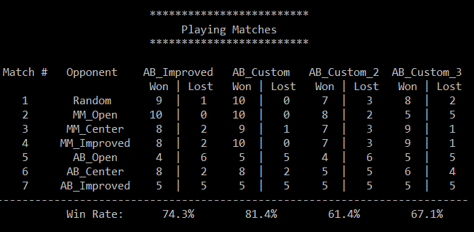

# AI Isolation Game
Isolation is a deterministic, two-player game of perfect information in which the players alternate turns moving a single piece from one cell to another on a board. Whenever either player occupies a cell, that cell becomes blocked for the remainder of the game. The first player with no remaining legal moves loses, and the opponent is declared the winner.

In this project, I'll build an game playing agent by implement adversarial searching algorithms (Minimax and AlphaBeta) to beat other players.


# Install
- This project run on **Python 3.5**
- Use the `requirements.txt` to install the required packages
```
pip install -r requirements.txt
```

# How to use the code
- All algorithms are implemented in `game_agent.py`
- Simple usage:
```
from game_agent import MinimaxPlayer, AlphaBetaPlayer
from isolation import Board

player1 = MinimaxPlayer()
player2 = AlphaBetaPlayer()

game = Board(player1, player2)
winner, history, outcome = game.play()
print("\nWinner: {}\nOutcome: {}".format(winner, outcome))
print(game.to_string())
print("Move history:\n{!s}".format(history))
```

# Game Visualization
The `isoviz` folder contains a modified version of `chessboard.js` that can animate games played on a 7x7 board. In order to use the board, you must run a local webserver by running `python -m http.server 8000` from your project directory (you can replace 8000 with another port number if that one is unavailable), then open your browser to `http://localhost:8000` and navigate to the `/isoviz/display.html` page. Enter the move history of an isolation match (i.e., the array returned by the Board.play() method) into the text area and run the match. Refresh the page to run a different game. (Feel free to submit pull requests with improvements to isoviz.)

# Tournament
Run the following python file to see the benchmark
```
python tournament.py
```


# Demo
Run the following python file to understand how the game work
```
python sample_players.py
```